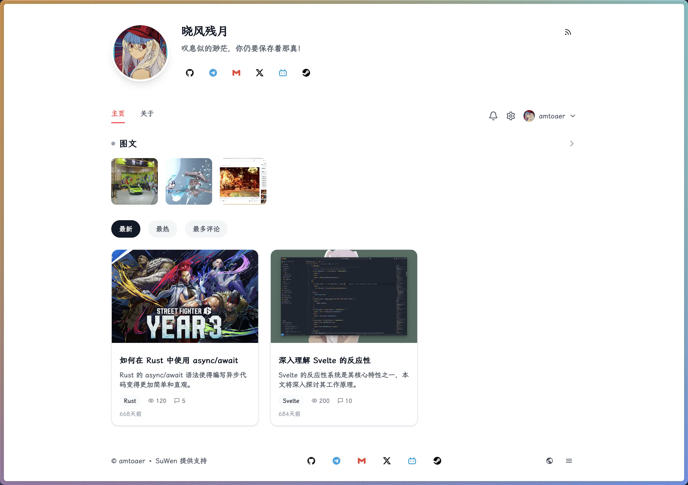
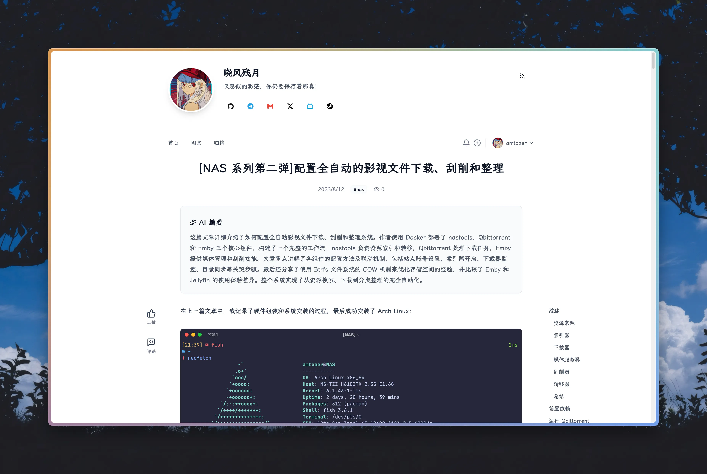

# 介绍

> [!CAUTION]
> 项目处于早期开发阶段，暂不推荐使用，可前往 [https://amto.cc/](https://amto.cc/) 查看 DEMO 展示。
>
> 因为没有备案，站点采用国内服务器 + Cloudflare 的方式临时部署。其中“用户到 Cloudflare”与“Cloudflare 到国内服务器”这两条访问路径均可能明显拖慢访问速度，导致 DEMO 页面加载时间较长体验不佳，并不代表项目实际效果。

Suwen（素文）是一个类 xLog 风格的个人博客系统，旨在提供一个简单、轻量、高性能的博客平台。

# 开发原因

我很喜欢 xLog 的设计，但不太满意它的访问速度（防火墙 + 区块链双重 DeBuff 慢出天际），再加上 xLog 发了新文章但主页长期不刷新、社区精选文章部分被币圈内容淹没等问题，促使我决定自己动手实现一个类似的博客系统。

目前想法是将数据全部存储在本地，不依赖任何第三方服务，尽可能做到简单、轻量和高性能。

缺点是不像 xLog 那样多用户可用，也不像 SSG 的静态博客可以直接托管在 GitHub Pages 上，需要自己有服务器才可以部署。

# 技术栈

+ 前端：Svelte/SvelteKit、Tailwind CSS、Shadcn UI
+ 后端：Rust、Axum、Sea-ORM

# 项目设计

~~其实也没什么设计，怎么好玩怎么来了~~

项目整体采用前后端分离的架构，前端使用 Svelte/SvelteKit，后端使用 Rust。两者**紧密集成，作为整体对外提供服务**。

项目 Rust 侧实现 API 层提供数据服务，并同时充当网关作为 HTTP 服务器的主入口，提供高性能请求处理的同时对所有服务端响应进行压缩（zstd、br、gzip）以节省带宽；Svelte/SvelteKit 侧采用混合渲染，专门处理用户界面和交互逻辑，其中首屏使用服务端渲染（SSR）方便 SEO，后续动态组件的交互（如点赞、评论）使用客户端渲染（CSR）直接调用 API 完成。

由于使用了 SvelteKit 的 SSR，项目需要额外引入一个 JavaScript Runtime 提供支持，该项目使用 Bun。

用户请求首先会到达 Rust 端，对于 Sitemap、RSS 等无样式页面或由 CSR 发起的 API 请求，Rust 侧会直接处理并返回数据。未匹配的其它请求会反向代理到 Svelte/SvelteKit 侧，由 Bun 进行处理。Bun 侧 SSR 同样会在服务端调用 Rust API 获取数据，渲染页面并返回给客户端。

总体来说，对于 SSR，请求路径为：

```
客户 -> 网关（Rust） -> 渲染服务（SvelteKit + Bun） -> 数据服务（Rust）
```

对于 CSR，请求路径为：

```
客户 -> 网关（Rust） -> 数据服务（Rust）
```

从某种意义上来说，Svelte/SvelteKit 在项目中充当了一个高级的模板引擎。

# 截图




# 当前进度

## 已完成（~~刚跑通~~）

+ [x] 前端实现主要页面组件，采用 SSR 渲染以方便 SEO
+ [x] 后端建表并实现基础信息、文章、图文的读取，和前端联调通过
+ [x] 一键导入 xLog 的文章和图文
+ [x] Rust 侧驱动的 Markdown 预渲染、目录生成与语法高亮，最小化前端工作
+ [x] Rust Axum 作为统一入口，反向代理至 SvelteKit 前端并自动处理 zstd、br、gzip 压缩，节省流量传输
+ [x] 支持为文章生成 AI 摘要，支持 RSS 订阅
+ [x] 构建 Docker 镜像

## 待完成

+ [ ] GitHub 风格的拓展 blockquote 支持
+ [ ] 自动翻译文章到多语言，并在 Sitemap、Html 头添加相应信息
+ [ ] 添加鉴权以支持用户系统，并围绕用户实现站点交互（点赞、评论、阅读量）
+ [ ] 添加交互通知提醒，用户可以自行配置提示方式，例如邮箱、WebHook 等
+ [ ] 实现管理后台，支持所有者在线管理文章、用户等信息