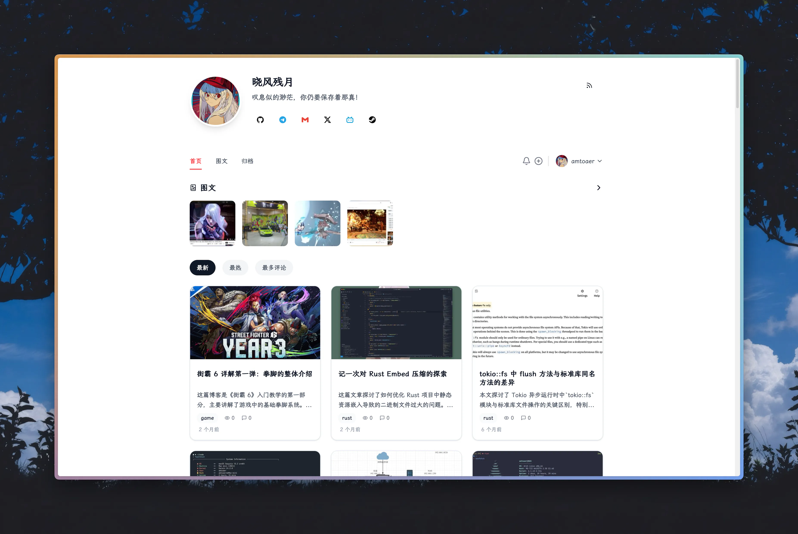

# 介绍

> [!CAUTION]
> 项目仍处于早期开发阶段，当前并不可用。

Suwen（素文）是一个类 Xlog 风格的个人博客系统，旨在提供一个简单、轻量、高性能的博客平台。

# 开发原因

我很喜欢 Xlog 的设计，但不太满意它的访问速度（防火墙 + 区块链双重 DeBuff 慢出天际），再加上 Xlog 发了新文章但主页长期不刷新、社区精选文章部分被币圈内容淹没等问题，促使我决定自己动手实现一个类似的博客系统。

目前想法是将数据全部存储在本地，不依赖任何第三方服务，尽可能做到简单、轻量和高性能。

缺点是不像 Xlog 那样多用户可用，也不像 SSG 的静态博客可以直接托管在 GitHub Pages 上，需要自己有服务器才可以部署。

# 技术栈

+ 前端：Svelte/SvelteKit、Tailwind CSS、Shadcn UI
+ 后端：Rust、Axum

# 截图

# 目标

+ [ ] 采用 Svelte/SvelteKit 构建前端，仅做页面渲染（不在 Node 侧实现后端逻辑），开启 SSR 方便 SEO
+ [ ] 采用 Rust 构建后端，提供 API、Markdown 渲染、Response 压缩、缓存等功能
+ [ ] 采用 Sqlite 数据库，提供数据持久化存储（待定）
+ [ ] 构建 Docker 镜像，Rust 部分作为入口，反向代理至 SvelteKit 前端